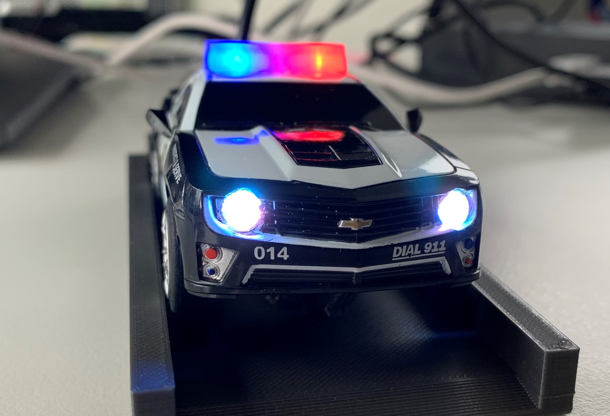

# Carrera Police Car
---
The Carrera Police Car is a modified Chevy Camaro SS with
* ESP32 uC
* 9-Axis Gyro Sensor (MPU9250)
* Accelerometer (MPU9250)
* Compass (MPU9250)
* Temperature Sensor (BME280)
* Humiditiy Sensor (BME280)
* Air Pressure Sensor (BME280)
* NeoPixel LEDs all around ( Headlights, Siren, Taillights)

## Requirements
- PlatformIO
- ESP32 uC
- Carrera Camaro (https://www.carrera-toys.com/en/product/20027523-chevrolet-camaro-sheriff)
- NeoPixel LEDs (Adafruit) x6

